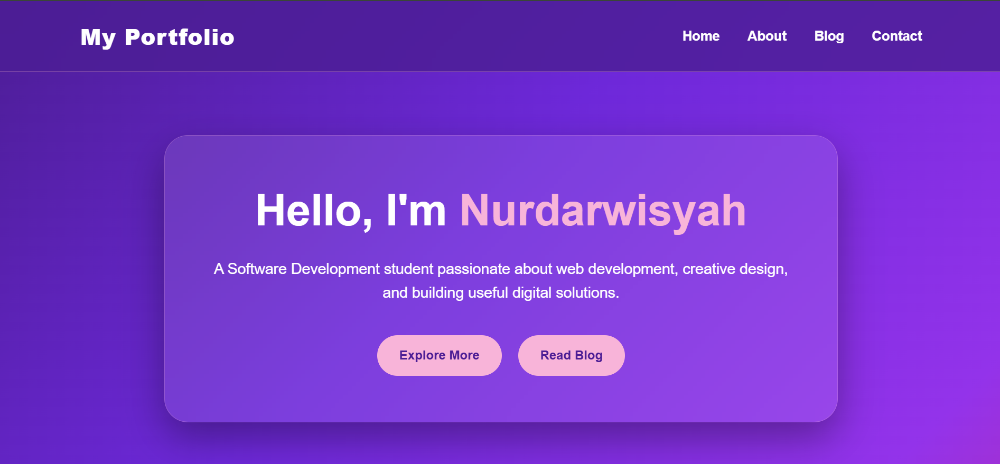
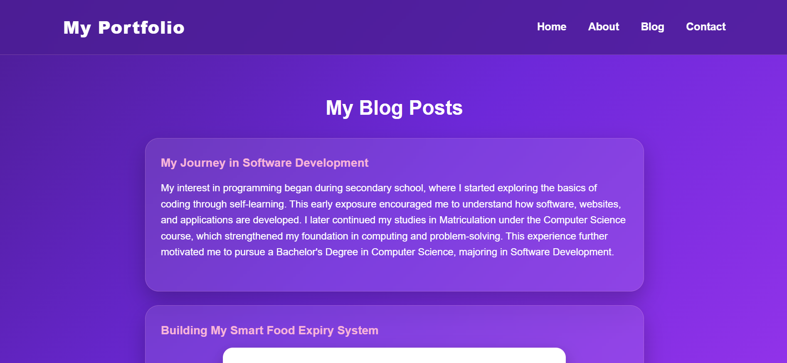
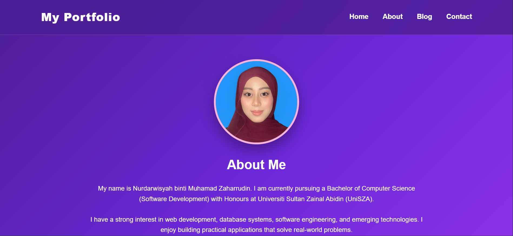

# Personal Blog Portfolio

## Description

This project is a personal blog and portfolio website developed for the CSD34203 Special Topics in Software Development course. The website presents my personal background, education, software development journey, projects, blog posts, and contact information.

## Features

- Home Page
- About Me Page
- Blog Page with sample posts
- Contact Page
- Project Portfolio Section
- Responsive Design
- Modern gradient layout
- Profile and project images
- Hover effects on cards and buttons

## Technologies Used

- HTML
- CSS
- JavaScript

## Folder Structure

## Folder Structure

## Folder Structure

```text
personal-blog
├── index.html
├── about.html
├── blog.html
├── contact.html
├── README.md
├── css
│   └── style.css
├── js
│   └── script.js
├── documents
│   └── resume.pdf
└── images
    ├── esyaa.jpg
    ├── expirysystem.jpg
    ├── Home.png
    ├── Blog.png
    └── About.png
## How To Run

1. Download this project folder.
2. Open the folder on your computer.
3. Double click `index.html` to view the website in a web browser.

## Screenshots

### Home Page



### Blog Page



### About Page



## Author

Nurdarwisyah binti Muhamad Zaharrudin
Bachelor of Computer Science (Software Development)
Universiti Sultan Zainal Abidin (UniSZA)

